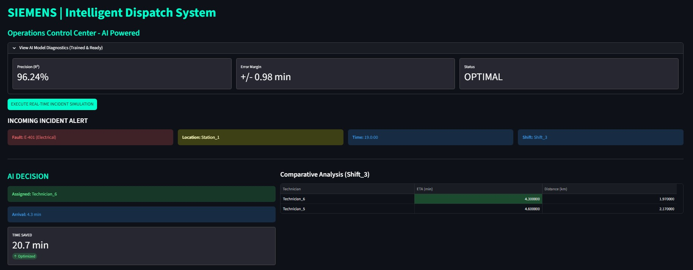
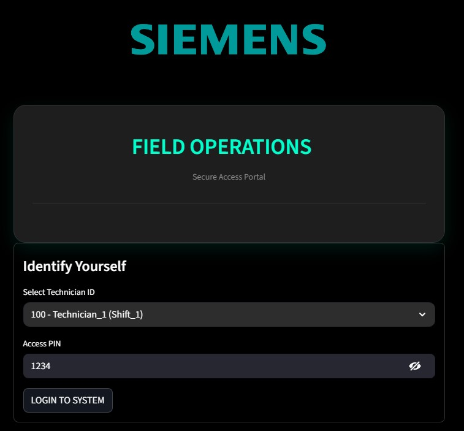
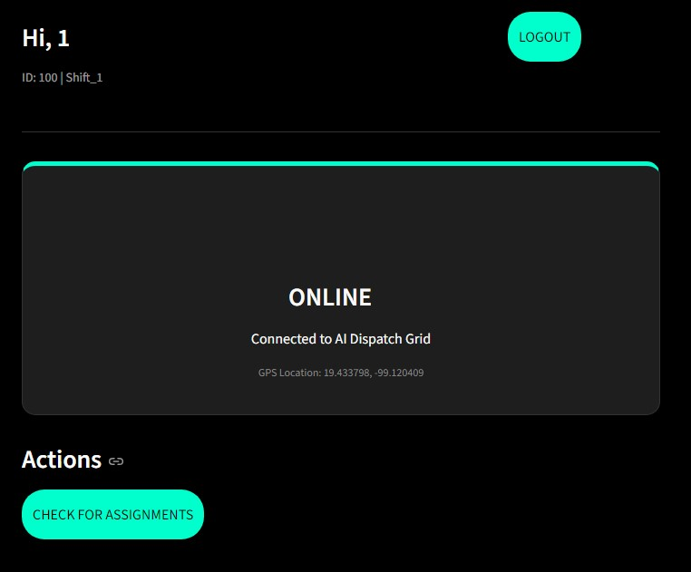
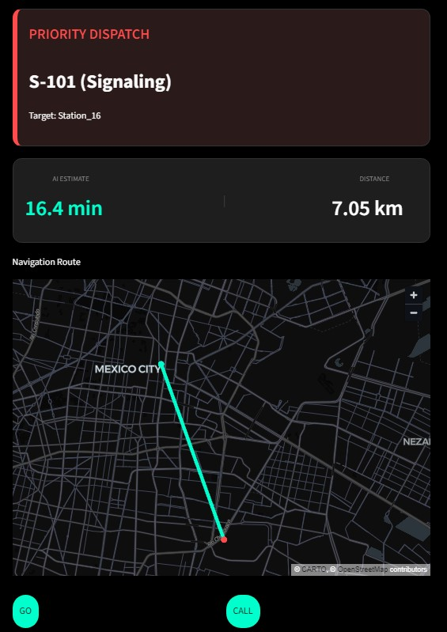

# Camoteros Mobility Hackathon Project: Parallel Emergency Dispatch AI

## Project Goal
Our solution tackles the critical 30-minute delay between a technical fault being detected and the manual dispatch order being formalized (C5 bureaucracy). We aim to use AI and data to dispatch the most efficient technician in parallel with the administrative process, ensuring the technician arrives at the fault location instantly when the formal order is released.

## The Solution: A Race Against Time
We use a Parallel Dispatch Strategy to convert the 30-minute bureaucratic delay into a technical travel window.

* **Problem:** The 30-minute lag between fault detection and formal dispatch order (C5).
* **Our Value:** Our system uses location data and optimization to send the closest, qualified technician immediately, using the 30-minute administrative window for travel.

---

## Technology Stack
* **Language:** Python (for all core scripts)
* **Data Processing:** Pandas, NumPy
* **AI/Optimization:** Scikit-learn (Simple Regression/Optimization for assignment)
* **Demo & MVP:** Streamlit
* **Version Control:** Git & GitHub

---

## Results

- **Response Time Reduction:**  
  By applying a parallel dispatch strategy, the system effectively eliminates the ~30-minute administrative delay by allowing technician travel to begin immediately after fault detection. In simulated scenarios, this results in the technician arriving at the fault location at the exact moment the formal dispatch order is released.

- **Optimized Technician Assignment:**  
  The system successfully assigns the most suitable technician based on geographic proximity and qualification level, reducing unnecessary travel distance and ensuring technical compatibility with the reported fault.

- **Functional MVP Demonstration:**  
  A fully operational Streamlit-based MVP demonstrates the complete workflow, including fault detection, technician selection, distance-based comparison, and real-time dispatch visualization using synthetic data.

  ### Dispatch System
  

  ### Techician App
  The following screenshots illustrate the main platform and the technician-facing application:
  | Login Menu | Main Menu | Technician Route |
  | :--- | :--- | :--- |
  |  |  |  |
---

## Team
- Ángel García de la Calleja - Data Architect - [LinkedIn](https://www.linkedin.com/in/angelgarciaing/)
- Adriana Solís García - AI Modeler - [LinkedIn](https://www.linkedin.com/in/adrianasgingeniera/)
- Diego Armando Soriano Sánchez - Platform Engineer - [LinkedIn](https://www.linkedin.com/in/diego-soriano-eng/)
- Jesús Manuel Ortiz Coeto - Full-Stack Engineer - [LinkedIn](https://www.linkedin.com/in/jes%C3%BAsmanuelortizcoeto/)

---

## Project Structure
To keep the project organized and professional, we use the following structure:
* **src:** Contains the main application scripts (app.py, app_technician.py) and data generators.
* **data:** Stores the generated datasets (.csv). Note: The apps read data from here automatically.
* **models:** Contains the core AI logic and training algorithms (ai_logic_core.py).

## How to Run the Demo

To run the final solution, the Platform Engineer must execute the main application script:

1.  **Clone the Repository:**
    ```bash
    git clone [https://github.com/DiegoASoriano/Camoteros_hackaton.git](https://github.com/DiegoASoriano/Camoteros_hackaton.git)
    ```
2.  **Set up Environment:** (Ensure you have Python 3.x installed.)
    ```bash
    pip install -r requirements.txt
    ```

3.  **Generate Synthetic Data:**
    Before running the apps, ensure the database is populated. Run these two scripts to generate 10 years of fault history and the technician roster in the data/ folder:
    ```bash
    python src/FaultHistoryGenerator.py
    python src/TechnicianInventoryGenerator.py
    ```
4.  **Run the Apps:**
    ```bash
    streamlit run src/app.py
    streamlit run src/app_technician.py
    ```
    (Note: Paths may need to be adjusted based on the final file structure.)
